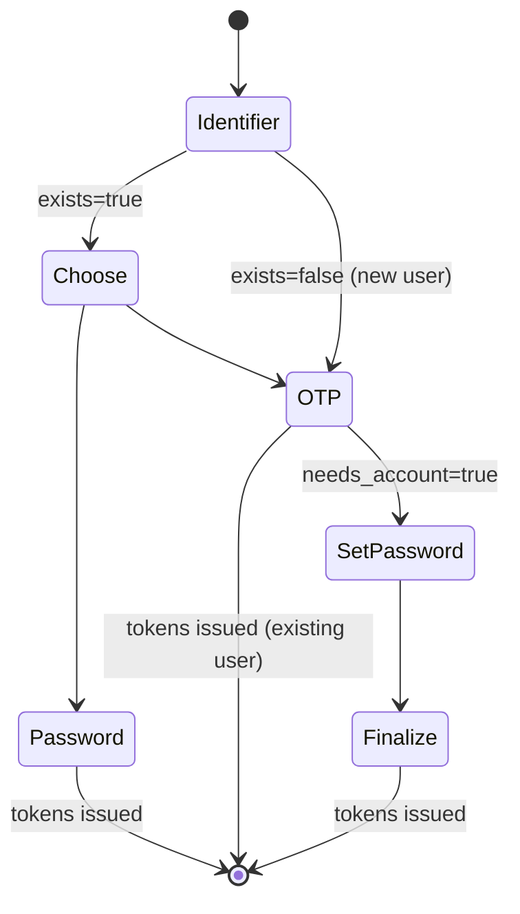
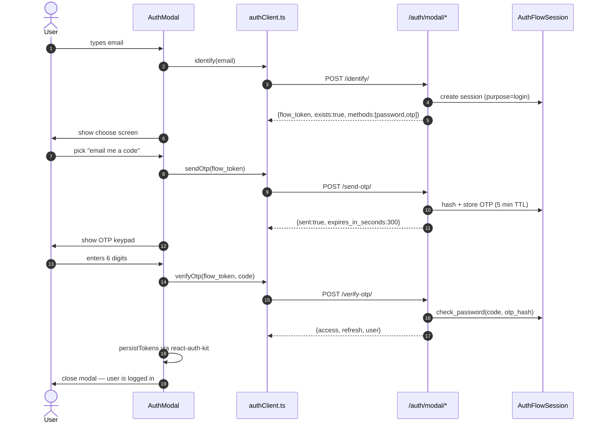
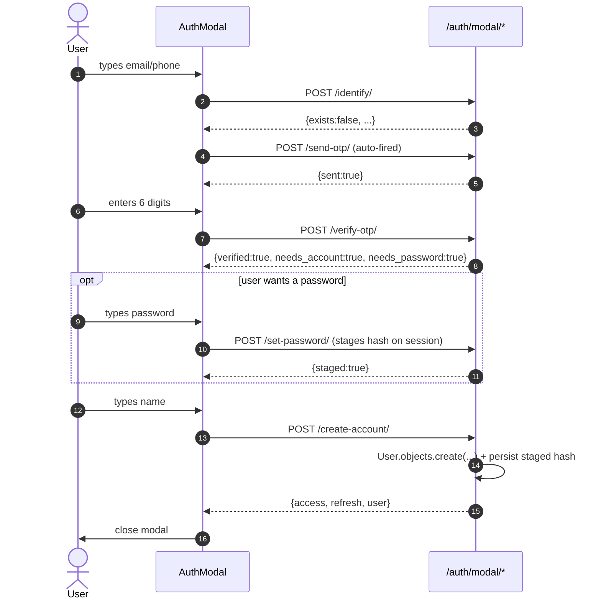

# Modal Auth Flow

State-machine login/signup that runs inside an `AuthModal` on the storefront,
without ever navigating away from the current page.

> Mounted under `/tradehut/api/v1/auth/modal/`. **Co-exists** with the legacy
> `/auth/login`, `/auth/register`, `/auth/otp/*` endpoints — those keep
> working unchanged.

---

## 1. State machine



Steps map 1:1 to FE states in `components/Auth/AuthModal.tsx`:
`identifier → choose → password | otp → set-pass → finalize`.

---

## 2. Sequence — happy path (existing user, OTP)



## 3. Sequence — happy path (new user, signup)



---

## 4. Endpoints

| Method | Path | Body | Returns |
|--------|------|------|---------|
| POST | `/identify/` | `{identifier}` | `{flow_token, identifier_kind, masked, exists, methods}` |
| POST | `/send-otp/` | `{flow_token}` | `{sent, expires_in_seconds, resend_in_seconds, attempts_remaining}` |
| POST | `/verify-otp/` | `{flow_token, code}` | tokens **OR** `{verified:true, needs_account:true}` |
| POST | `/login-password/` | `{flow_token, password}` | tokens |
| POST | `/set-password/` | `{flow_token, password}` | `{staged:true}` |
| POST | `/create-account/` | `{flow_token, name?, username?}` | tokens |
| POST | `/refresh/` | `{refresh}` | `{access}` |
| POST | `/logout/` | `{refresh?}` | `{ok:true}` |

All endpoints accept the `flow_token` either in the JSON body or via the
`X-Auth-Flow` header.

---

## 5. Security model

### OTP storage

```python
otp_hash = make_password(plaintext)        # PBKDF2/argon2 per AUTH_PASSWORD_HASHERS
check_password(code, otp_hash)              # constant-time compare
```

Plaintext is returned by `AuthFlowSession.issue_otp()` exactly **once**, then
the row holds only the hash. After successful verify the hash is blanked
so it can't be replayed.

### Rate limits

Defined in `throttles.py`, applied per-endpoint:

| Endpoint | Limit | Key |
|----------|-------|-----|
| `/identify/` | 30/min | client IP |
| `/send-otp/` | 3/min + 10/hour | identifier |
| `/verify-otp/` | 20/hour | identifier |
| `/login-password/` | 10/hour | identifier |

A per-session attempt counter (`max_attempts=5`) provides a second wall
inside the throttle envelope.

### Account enumeration

`/identify/` returns the **same shape** for existing and new identifiers
(only the `exists` boolean and available `methods` differ — both of which
the FE already deduces from successful flows). Response time is constant
because the hash work happens later, in `/send-otp/` or `/login-password/`.

### Token lifetime

Same as everywhere else in the app — DRF SimpleJWT defaults
(`ACCESS_TOKEN_LIFETIME = 30m`, `REFRESH_TOKEN_LIFETIME = 7d`). Refresh
tokens are blacklisted on `/logout/` (best-effort).

---

## 6. Frontend integration

```tsx
// any client component
import { useAuthModal } from '@/providers/AuthModalProvider'

const { openAuthModal } = useAuthModal()
<button onClick={() => openAuthModal('auto')}>Sign in</button>
```

Modes:
- `'auto'` — let the backend decide (login if exists, signup otherwise).
- `'login'` — user clicked "Sign in" specifically.
- `'signup'` — user clicked "Create account" — skip the password choice
  and go straight to OTP delivery for fresh accounts.

Token persistence is delegated to **react-auth-kit** via the same store
the existing `/auth/login` page uses, so axios interceptors and protected
routes need zero changes.

---

## 7. File map

```text
Stores-BE/apps/authentication/
├── models.py                ← + AuthFlowSession, mask_identifier, _normalise_identifier
├── modal_views.py           ← all 8 endpoints (identify → logout)
├── throttles.py             ← per-identifier throttles
├── urls.py                  ← + /modal/* routes
├── migrations/0003_authflowsession.py
└── MODAL_FLOW.md            ← this file

Stores-FE/
├── lib/authClient.ts        ← typed wrapper, single source of truth for endpoints
├── providers/AuthModalProvider.tsx ← context + global modal mount
└── components/Auth/AuthModal.tsx   ← state-machine UI
```
