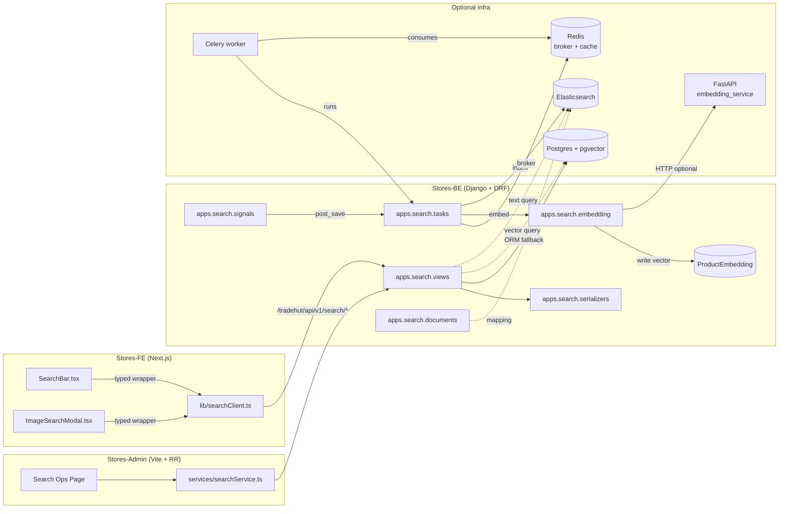
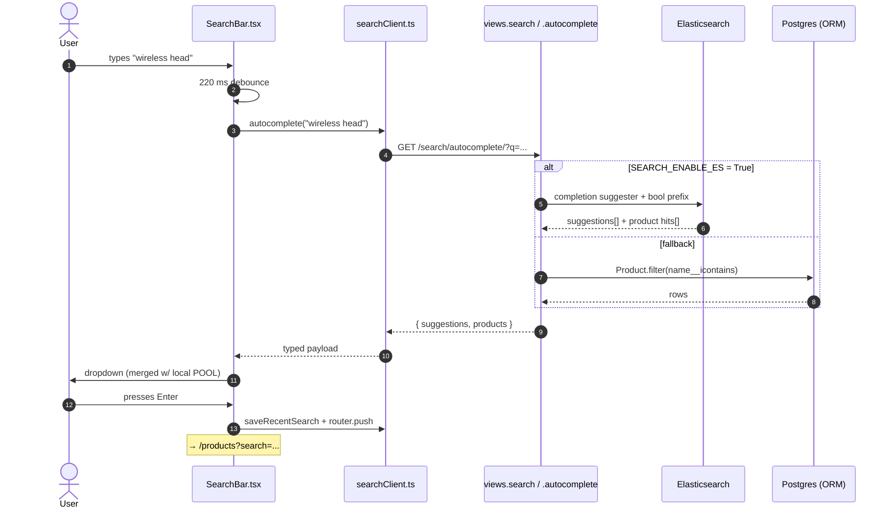
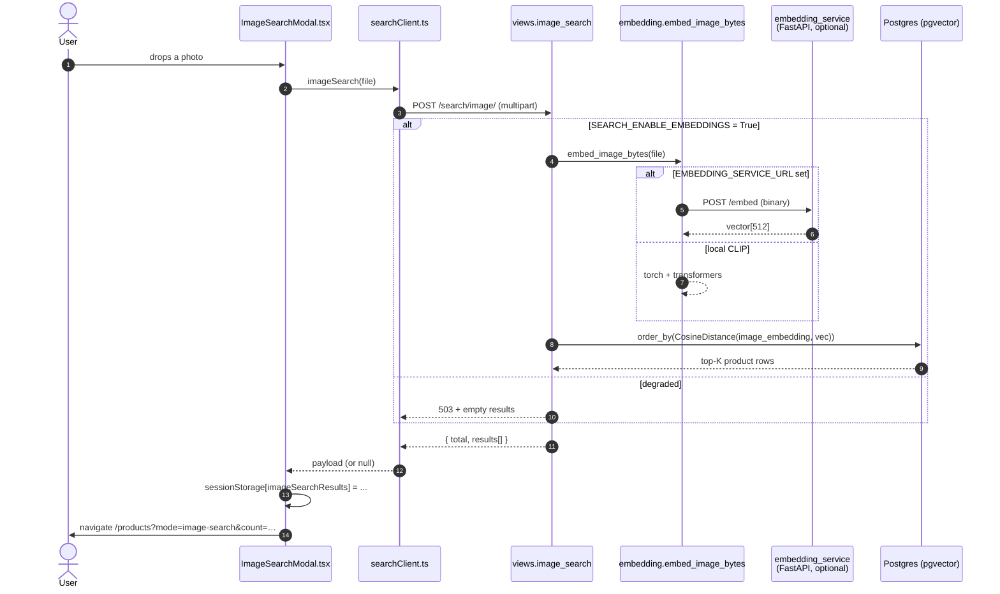
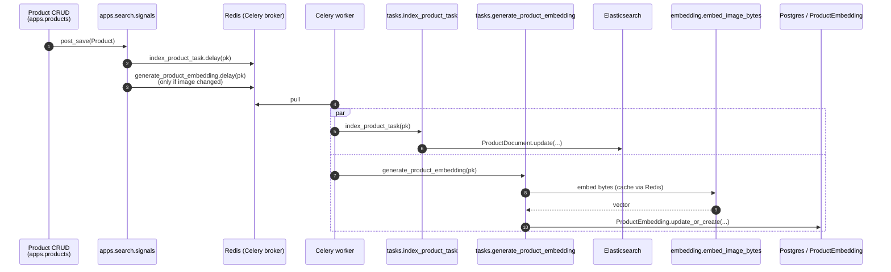
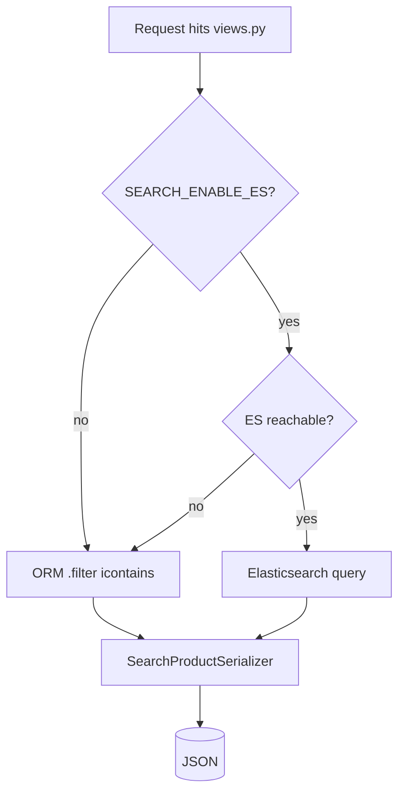
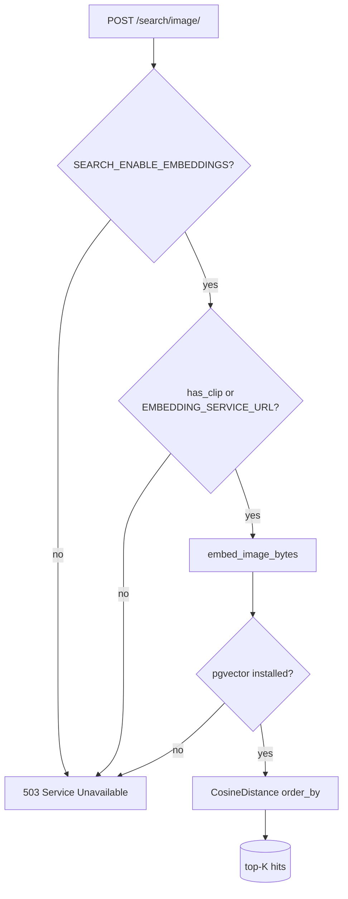
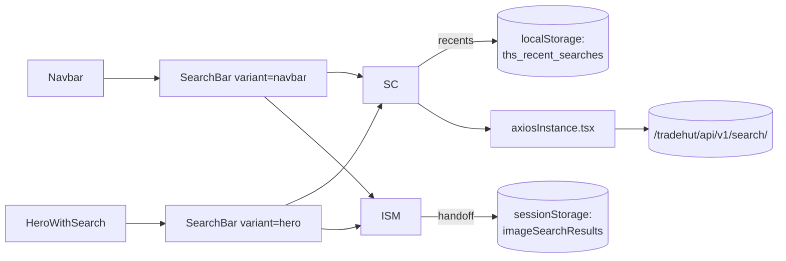
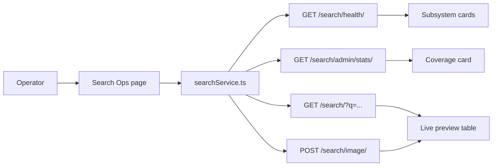
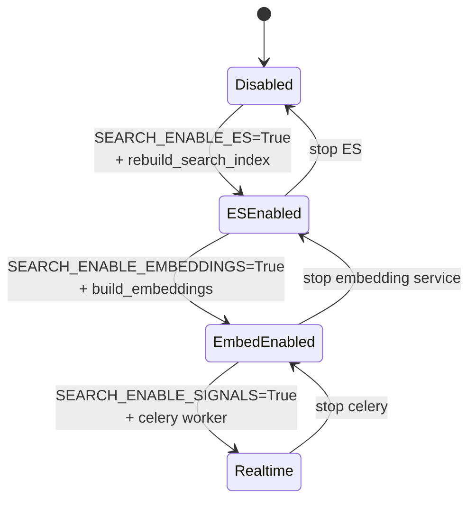

# TradeHut Search — End-to-End Flow

This document is the canonical map of the search subsystem. It covers every
moving part from a keystroke in the navbar to a CLIP embedding landing in
Postgres, including every fallback path that keeps the platform alive when
optional infra is missing.

> If you are looking for **how to enable / install** the search stack, read
> `README.md` in this same folder. This file is about **how the pieces talk**.

---

## 1. System map



Legend
- Solid arrow `→` : runtime data flow.
- Dashed arrow `⇢` : fast path; falls back if the target is offline.
- Anything inside **Optional infra** can be absent without breaking the API.

---

## 2. The three primary flows

### 2.1 Text search & autocomplete



Key properties
- The dropdown **never goes empty**: even if `autocomplete()` returns `null`,
  the SearchBar merges local mock suggestions to keep the UX alive.
- Submitting hits `/products?search=…` (existing route) — search delegation
  reuses the catalogue page rather than introducing a new one.

### 2.2 Image / visual search



### 2.3 Auto-indexing on product mutation



Notes
- `pre_save` snapshots the **previous image hash** onto `instance._old_image_hash`
  so `post_save` can decide whether to re-embed.
- `post_delete` enqueues `deindex_product_task(pk)`.
- All three tasks use `safe_shared_task` — if Celery isn't configured, they
  silently no-op rather than raising at import time.

---

## 3. Compatibility matrix

The app boots in any combination below. The behaviour column tells you what
the FE/Admin will observe.

| `SEARCH_ENABLE_ES` | `SEARCH_ENABLE_EMBEDDINGS` | `SEARCH_ENABLE_SIGNALS` | Behaviour                                                                 |
|--------------------|----------------------------|-------------------------|---------------------------------------------------------------------------|
| `False`            | `False`                    | `False`                 | ORM fallback only. Visual search returns 503. **Default for fresh checkouts.** |
| `True`             | `False`                    | `False`                 | ES-powered search & autocomplete. Visual search 503. Manual `rebuild_search_index`. |
| `True`             | `True`                     | `False`                 | Full search + visual. Embeddings only built via `manage.py build_embeddings`. |
| `True`             | `True`                     | `True`                  | Production: real-time signals re-index ES & re-embed on every mutation.   |





---

## 4. Data flow per endpoint

| Verb   | Path                                          | View                  | Fast path          | Fallback        |
|--------|-----------------------------------------------|-----------------------|--------------------|-----------------|
| GET    | `/search/`                                    | `views.search`        | Elasticsearch      | ORM `icontains` |
| GET    | `/search/autocomplete/`                       | `views.autocomplete`  | ES completion + prefix | ORM             |
| POST   | `/search/image/`                              | `views.image_search`  | CLIP + pgvector    | 503             |
| GET    | `/search/visual/`                             | `views.visual_search` | CLIP text → pgvector | 503           |
| GET    | `/search/products/<uuid>/similar/`            | `views.similar_products` | pgvector neighbour | Same-category ORM |
| GET    | `/search/health/`                             | `views.health`        | always live        | n/a             |
| GET    | `/search/admin/stats/`                        | `views.admin_stats`   | admin-only         | n/a             |

---

## 5. Frontend integration touchpoints



- One client (`searchClient.ts`) is shared by **both** navbar and hero search bars.
- Recents persist in `localStorage` under `ths_recent_searches` (8 entries).
- Image-search results are handed off to `/products` via `sessionStorage` so
  the catalogue page can render them without a second round-trip.

---

## 6. Admin ops flow



The Admin page is the operator's single pane:

- **Subsystem health cards** — one each for Elasticsearch and visual search,
  showing connection URL and library presence.
- **Coverage card** — `embeddings_total / products_total`.
- **Live text preview** — typed query, real engine label (`elasticsearch` /
  `orm`), and the actual hits table.
- **Live image preview** — file picker → CLIP → pgvector → table.

---

## 7. Failure modes (what the user sees)

| Failure                         | FE behaviour                                | Admin behaviour              |
|---------------------------------|---------------------------------------------|------------------------------|
| Backend unreachable             | Local mock dropdown; "Searching…" clears.   | "Stats unavailable" cards.   |
| ES disabled                     | Autocomplete via ORM; identical UI.         | ES card shows **Disabled**.  |
| pgvector / CLIP missing         | Image modal: "Visual search is unavailable" toast. | Visual card shows **Disabled**, with the exact env flag to flip. |
| Celery off but signals on       | App keeps booting; tasks silently no-op.    | Coverage stays flat — flagged in card. |
| Product image deleted           | Embedding row remains until next `post_save`/`post_delete`. | n/a                          |

---

## 8. Operational lifecycle



Recommended progression for a new environment:

1. Bring up Postgres + Django (no flags) → confirm ORM fallback works.
2. Bring up Elasticsearch → flip `SEARCH_ENABLE_ES`, run `rebuild_search_index`.
3. Bring up Redis + a worker, optionally the embedding service → flip
   `SEARCH_ENABLE_EMBEDDINGS`, run `build_embeddings`.
4. Flip `SEARCH_ENABLE_SIGNALS` last, once you trust the indexing.

Diagnostic command for any state:

```bash
python manage.py search_health
```

---

## 9. File map

```text
Stores-BE/apps/search/
├── __init__.py
├── apps.py                       # SearchConfig — conditional signal hookup
├── compat.py                     # HAS_PGVECTOR / HAS_ELASTICSEARCH / has_clip()
├── documents.py                  # ProductDocument (ES mapping)
├── embedding.py                  # CLIP local + remote service
├── models.py                     # ProductEmbedding sidecar
├── serializers.py                # SearchProductSerializer / SearchHitSerializer
├── signals.py                    # post_save / pre_save / post_delete
├── tasks.py                      # Celery tasks (safe_shared_task)
├── urls.py                       # /search/* routing
├── views.py                      # Endpoints w/ fast path + fallback
├── migrations/0001_initial.py    # pgvector-aware
├── management/commands/
│   ├── build_embeddings.py
│   ├── rebuild_search_index.py
│   └── search_health.py
├── README.md                     # Setup & enabling
└── FLOW.md                       # ← this file

Stores-FE/
├── lib/searchClient.ts           # Typed API client (FE)
└── components/common/
    ├── SearchBar.tsx             # Navbar + hero variants
    └── ImageSearchModal.tsx      # Visual search uploader

Stores-Admin/
├── src/services/searchService.ts # Typed API client (Admin)
└── src/pages/admin/Search/       # Search Ops dashboard
```

---

## 10. Glossary

- **Sidecar model** — `ProductEmbedding` is 1:1 with `Product` but lives in a
  separate table so the core catalogue model is never touched.
- **Fast path / fallback path** — every read endpoint has both. The fast path
  uses ES/pgvector; the fallback uses the Django ORM and is always available.
- **safe_shared_task** — wrapper around Celery's `shared_task` that turns
  missing-broker errors into a no-op log instead of crashing the request.
- **Engine label** — every `/search/` response carries `engine: "elasticsearch"`
  or `engine: "orm"` so clients (and the Admin preview) can show what served
  them.
